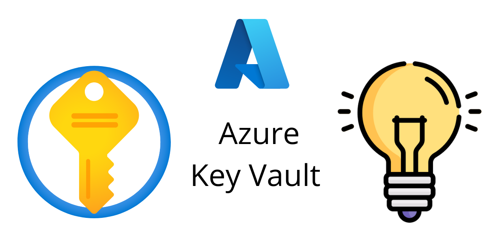

## Azure Keyvault:
#What is Azure keyvault?
- Azure Key Vault is a service for managing cryptographic keys and secret items used by services and cloud applications. Key Vault provides protection for secret items such as passwords, certificates, connection strings, API and encryption keys. 

- Azure Key Vaults can be software or hardware protected. In scenarios where the maximum security possible is required, the keys and secret items can be stored in hardware security modules (HSMs). These HSMs are Federal Information Processing Standard (FIPS) 140-2 Level 2 validated and operate in a way that the secret never leaves the HSM boundary. 

- Microsoft uses nCipher hardware security modules and specialist tools can be used to move keys between the HSM and the Azure Key Vault. Microsoft will never be able to see or extract data from an Azure Key Vault. 

- Service infrastructure within Azure can simply be granted access to retrieve specific secrets from the vault via RBAC permissions. For example, the SQL connection string for a web front end can be stored within the vault and the web application service principle can be granted rights to the connection string. This dramatically enhances the security of the web application as it does not store the connection string locally.

#Use Cases:
- Secrets Management: Azure Key Vault can be used to securely store and control access to secrets, such as passwords, database connection strings, authentication keys, storage account keys, tokens, API keys, certificates, and other secrets.
- Key Management: Azure Key Vault can be used as a Key Management solution. It makes it easy to create and control the encryption keys used to encrypt your data.
- Certificate Management: Azure Key Vault enables you to provision, manage, and deploy public and private SSL/TLS certificates for use with Azure integrated services.
#Summary
- Azure Key Vault streamlines the secret, key, and certificate management process and enables you to maintain strict control over secrets/keys that access and encrypt your data.